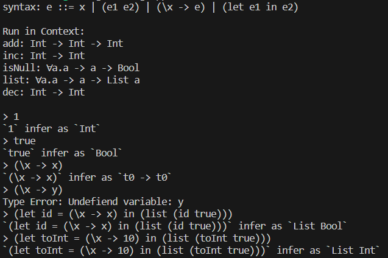

# Syntax

$$
e = x \ | \ e_1 e_2  \ | \ \backslash x \rarr e \ | \ let \ e_1 \ in \ e_2 \\
\tau = \alpha \ | \ C \ \tau_1 \ ... \ \tau_n \\
\sigma = \tau \ | \ \forall \alpha . \sigma \\
\Gamma = (empty) \ | \ \Gamma, e : \sigma
$$

# Sematics

$$
\frac{
	x : \sigma \in \Gamma
}{
	\Gamma \vdash x : \sigma
} \hspace{1cm} [variable] \\

\frac{
	\Gamma \vdash e_0 : \tau_a \rarr \tau_b \hspace{0.5cm}
	\Gamma \vdash e_1 : \tau_a
}{
	\Gamma \vdash e_0 e_1 : \tau_b
} \hspace{1cm} [application] \\

\frac{
	\Gamma,x : \tau_a \vdash e : \tau_b
}{
	\Gamma \vdash \backslash x \rarr e : \tau_a \rarr \tau_b
} \hspace{1cm} [abstraction] \\

\frac{
	\Gamma \vdash e_0 : \sigma \hspace{0.5cm}
	\Gamma,x : \sigma \vdash e_1 : \tau
}{
	\Gamma \vdash let \ x = e_0 \ in \ e_1 : \tau
} \hspace{1cm} [let] \\

\frac{
	\Gamma \vdash e : \sigma_a \hspace{0.5cm}
	\sigma_a \sqsubseteq \sigma_b
}{
	\Gamma \vdash e : \sigma_b
} \hspace{1cm} [instantiation] \\

\frac{
	\Gamma \vdash e : \sigma \hspace{0.5cm}
	\alpha \notin FV(\Gamma)
}{
	\Gamma \vdash e : \forall \alpha . \sigma
} \hspace{1cm} [generalisation] \\
$$

# Algorithm W

$$
W: TypeEnv \times Expr \rarr Subst \times Type \\

W(\Gamma, x) = (id, \{ \vec \beta / \vec \alpha \}\tau) \hspace{0.5cm}
where \ \Gamma(x) = \forall \vec \alpha . \tau ,\ \ new \ \vec \beta \\

W(\Gamma, \lambda x.e) = let \ (S_1, \tau_1) = W(\Gamma+x:\beta, e), new\ \beta \ in \ (S_1, S_1\beta \rarr \tau_1) \\

W(\Gamma, e_1 e_2) = let \ (S_1, \tau_1) = W(\Gamma, e_1) \\
(S_2, \tau_2) = W(S1\Gamma, e_2) \\
S_3 = U(S_2\tau_1, \tau_2 \rarr \beta), \ new \ \beta \\
in (S_3 S_2 S_1, S_3\beta)\\

W(\Gamma, let \ x = e_1 \ in \ e_2) = 
let \ (S_1, \tau_1) = W(\Gamma, e_1) \\
\ (S_2, \tau_2) = W(S_1\Gamma + x : Clos_{S_1\tau}(\tau_1), e2) \\
in \ (S_2S_1, \tau_2)
$$

# Demo

run demo:

```
cargo run --bin app
```


